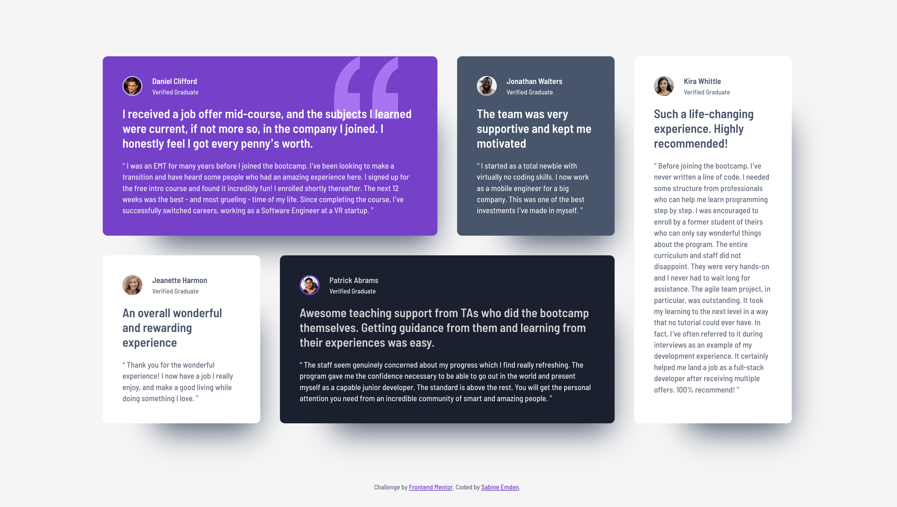

# Frontend Mentor - Testimonials grid section solution

This is a solution to the [Testimonials grid section challenge on Frontend Mentor](https://www.frontendmentor.io/challenges/testimonials-grid-section-Nnw6J7Un7). Frontend Mentor challenges help me improve my coding skills by building realistic projects.

## Table of contents

- [Overview](#overview)
  - [The challenge](#the-challenge)
  - [Screenshot](#screenshot)
  - [Links](#links)
- [My process](#my-process)
  - [Built with](#built-with)
  - [What I learned](#what-i-learned)
  - [Continued development](#continued-development)
  - [Useful resources](#useful-resources)
- [Author](#author)
- [Acknowledgments](#acknowledgments)

## Overview

### The challenge

The brief for this challenge was to build out the testimonials grid section and get it looking as close to the design as possible, starting with the following assets:

- Figma design file access
- JPEG design files for mobile & desktop layouts
- Style guide for fonts, colors, etc.
- Optimized image assets
- HTML file with pre-written content

Users should be able to:

- View the optimal layout for the site depending on their device's screen size

### Screenshot



### Links

- [Frontend Mentor solution](https://www.frontendmentor.io/solutions/testimonials-grid-section-48qxfjVrkF)
- [Live site](https://sabineemden.github.io/fm-testimonials-grit-section/)

## My process

I completed this challenge as part of the Frontend Mentor learning path [Building responsive layouts](https://www.frontendmentor.io/learning-paths/building-responsive-layouts--z1qCXVqkD). It is the third of four challenges on this learning path and focuses on building flexible layouts with CSS Grid.

### Built with

- Semantic HTML5 markup
- CSS custom properties
- Flexbox
- CSS Grid
- Mobile-first workflow

### What I learned

For the desktop layout, I wanted to have four equally sized columns with a maximum width of `16rem`. I had hoped I could use the `minmax()` CSS function. It is used in CSS Grids to define a size rage greater than or equal to _min_ and less than or equal to _max_. I learned `<flex>` values can only be used for _max_ and are invalid for _min_. That is, `minmax(1fr, 16rem)` is not valid CSS and doesn't work. The `min()` CSS function cannot be used with `fr` either.

As a work-around, I set a `max-width` on the grid container:

```css
@media (min-width: 62rem) {
  .testimonials-grid {
    grid-template-columns: repeat(4, 1fr);
    max-width: 70rem;
  }

  /* ... */
}
```

### Continued development

I feel confident building basic grid layouts like the one in this challenge.

Building layouts that are flexible and work well across all screen sizes is a fundamental skill in front-end development. I will be able to use and refine it in future web development projects.

### Useful resources

- [minmax()](https://developer.mozilla.org/en-US/docs/Web/CSS/Reference/Values/minmax) on MDN - The documentation for `minmax()` made it clear using the CSS function to set a maximum track size for equally sized grid tracks would not work.

## Author

I'm an aspiring web developer and a former chemist. What I bring from chemistry to software development is a systematic approach to problem solving and the perseverance to not give up easily.

- Frontend Mentor - [@SabineEmden](https://www.frontendmentor.io/profile/SabineEmden)
- Personal Website - [Sabine Emden](https://www.sabineemden.com/)
- Mastodon - [@sabineemden](https://social.tchncs.de/@sabineemden)

## Acknowledgments

This solution uses Josh Comeau's [CSS reset](https://www.joshwcomeau.com/css/custom-css-reset/).

The font family used in this project is [Barlow Semi Condensed](https://fonts.google.com/specimen/Barlow+Semi+Condensed). The fonts are licensed under the [Open Font License](https://openfontlicense.org/).
